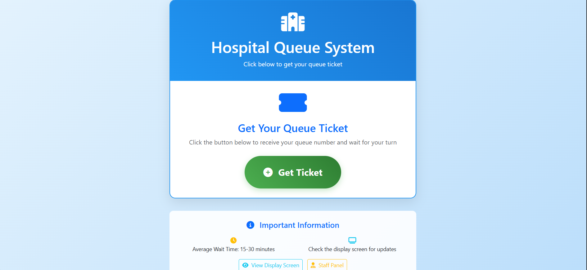
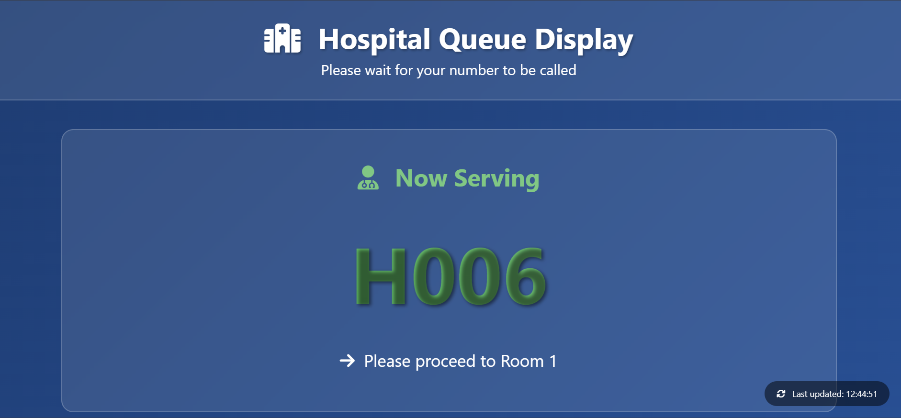
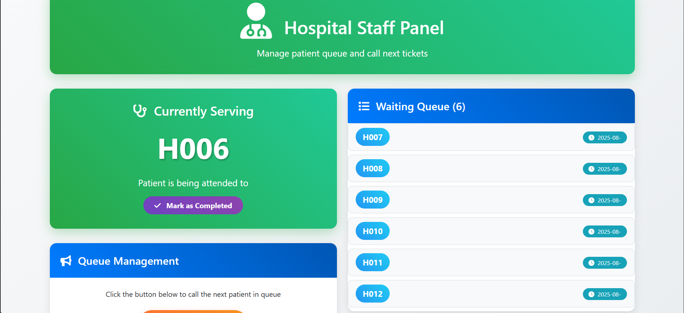

# 🏥 Hospital Queue/Ticketing System

[](https://www.python.org/downloads/)
[](https://flask.palletsprojects.com/)
[](LICENSE)

A modern, full-stack web application that revolutionizes patient queue management in healthcare facilities through automated ticketing, real-time displays, and intelligent queue control.


## ✨ Features

- 🎫 **Automated Ticket Generation** - Sequential numbering with instant issuance
- 📺 **Real-Time Display** - Live queue updates on waiting room screens
- 🔊 **Audio Announcements** - Text-to-speech patient notifications
- 📄 **PDF Ticketing** - Professional tickets with QR codes
- 👨‍⚕️ **Staff Panel** - One-click queue management interface
- 📊 **Queue Analytics** - Historical data and timestamps
- 📱 **Responsive Design** - Works on all devices

## 🖼️ Screenshots

### Patient Interface


### Waiting Room Display


### Staff Management Panel


## 🛠️ Tech Stack

**Backend:**
- Python 3.8+
- Flask 2.3.3
- SQLite
- gTTS (Text-to-Speech)
- pygame (Audio)
- ReportLab (PDF)

**Frontend:**
- HTML5/CSS3
- JavaScript (Vanilla)
- Bootstrap 5
- AJAX for real-time updates

## 🚀 Quick Start

### Prerequisites
- Python 3.8 or higher
- pip package manager

### Installation

1. **Clone the repository**
```bash
git clone https://github.com/Faustine254/hospital-queue-system.git
cd hospital-queue-system
```

2. **Create virtual environment**
```bash
python -m venv hospital_env

# Activate virtual environment
# Windows:
hospital_env\Scripts\activate
# macOS/Linux:
source hospital_env/bin/activate
```

3. **Install dependencies**
```bash
pip install -r requirements.txt
```

4. **Run the application**
```bash
python app.py
```

5. **Access the system**
- Patient Interface: http://localhost:5000/get_ticket
- Display Screen: http://localhost:5000/display
- Staff Panel: http://localhost:5000/staff

## 📖 Usage

### For Patients
1. Navigate to the ticket kiosk
2. Click "Get Ticket"
3. Note your ticket number
4. Wait for your number to be called

### For Staff
1. Open the staff panel
2. Click "Call Next Ticket" to serve the next patient
3. Audio announcement plays automatically
4. Mark patient as complete when done

## 🏗️ Project Structure
hospital_queue/
├── app.py                 # Main Flask application
├── requirements.txt       # Python dependencies
├── database.db           # SQLite database (auto-created)
├── templates/            # HTML templates
│   ├── get_ticket.html  # Patient interface
│   ├── display.html     # Display screen
│   └── staff.html       # Staff panel
├── static/              # Static files (CSS, JS, images)
├── screenshots/         # Project screenshots
└── README.md           # This file
## 📊 Database Schema
```sql
CREATE TABLE tickets (
    id INTEGER PRIMARY KEY AUTOINCREMENT,
    ticket_number TEXT UNIQUE NOT NULL,
    status TEXT DEFAULT 'waiting',
    timestamp DATETIME DEFAULT CURRENT_TIMESTAMP
);
```

## 🧪 Testing

Run tests (if you add them):
```bash
python -m pytest tests/
```

## 🔮 Future Enhancements

- [ ] SMS notifications for patients
- [ ] Multi-department support
- [ ] Mobile app integration
- [ ] Analytics dashboard
- [ ] Cloud deployment
- [ ] Multi-language support

## 🤝 Contributing

Contributions are welcome! Please feel free to submit a Pull Request.

1. Fork the repository
2. Create your feature branch (`git checkout -b feature/AmazingFeature`)
3. Commit your changes (`git commit -m 'Add some AmazingFeature'`)
4. Push to the branch (`git push origin feature/AmazingFeature`)
5. Open a Pull Request

## 📄 License

This project is licensed under the MIT License - see the [LICENSE](LICENSE) file for details.

## 👨‍💻 Author

**Your Name**
- LinkedIn: [Faustine Marucha](www.linkedin.com/in/faustine-marucha-184077348)
- Email: faustinemarucha@gmail.com

## 🙏 Acknowledgments

- Built with Python Flask and modern web technologies
- Inspired by the need for better healthcare experiences

## 📞 Support

For support, email faustinemarucha@gmail.com
 or open an issue in this repository.

---

⭐ If you found this project helpful, please give it a star!
